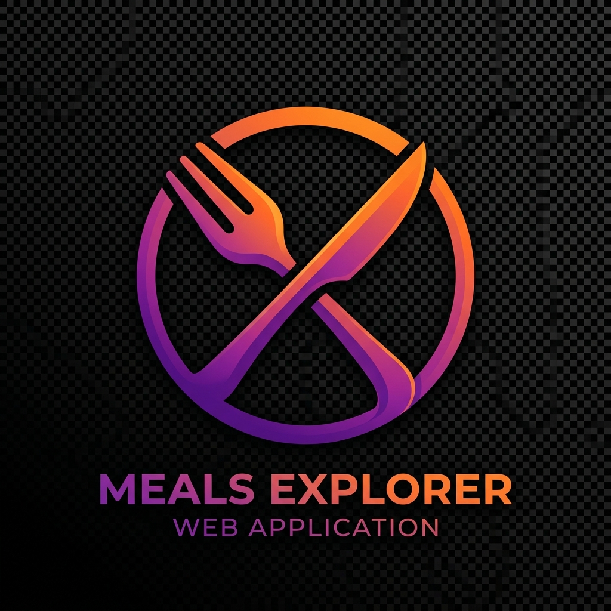

  
  <h1>Meals Listing Interface</h1>
  
A premium, responsive, and beautifully designed application for browsing meals from the FreeAPI.

  <!-- Badges -->
  

    
    
    
    
  

## Features
- **Premium Design:** Glassmorphic dark mode UI, smooth animations, and responsive layouts.
- **Search & Filter:** Find exactly what you want with the search bar or category filters.
- **Detailed Views:** Click on any meal to see a beautifully laid-out modal with ingredients and instructions.
- **Vanilla Setup:** Built with pure HTML, CSS, and Vanilla JavaScript.

## Setup & Running Locally
1. Clone the repository.
2. Open `index.html` in your browser or run a local server (e.g. `npx serve .`).
3. Enjoy the meals!
